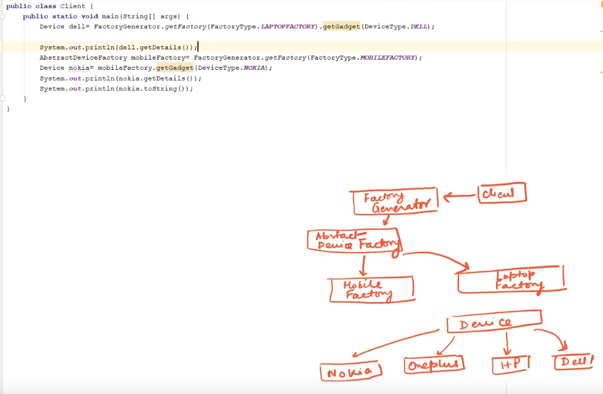
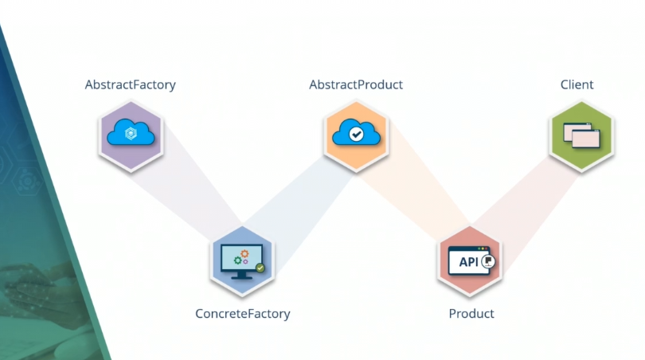

# Creational Design Pattern
- Creational design patterns are concerned with the way of creating objects. 
- [javatPoint](https://www.javatpoint.com/creational-design-patterns)
- There are following 6 types of creational design patterns.
	- Factory Method Pattern
	- Abstract Factory Pattern
	- Singleton Pattern
	- Prototype Pattern
	- Builder Pattern
	- Object Pool Pattern

# Factory 
- A Factory Pattern or Factory Method Pattern says that just define an interface or abstract class for creating an object but let the subclasses decide which class to instantiate.
- In other words, subclasses are responsible to create the instance of the class.
- [javatPoint](https://www.javatpoint.com/factory-method-design-pattern)

# Abstract Factory
- [jtP](https://www.javatpoint.com/abstract-factory-pattern)
- a good example
	-  

	- here factoryGenerator calls AbstractDeviceFactory that further creates laptop or mobile based on the params supplied.
	- here client dont care about the object creation.
- 
# Singleton
- Singleton Pattern says that just"define a class that has only one instance and provides a global point of access to it".
- [jtp](https://www.javatpoint.com/singleton-design-pattern-in-java)

# Prototype
- Prototype Pattern says that cloning of an existing object instead of creating new one and can also be customized as per the requirement.
- This pattern should be followed, if the cost of creating a new object is expensive and resource intensive.
- [jtp](https://www.javatpoint.com/prototype-design-pattern)
# Builder 
- Builder Pattern says that "construct a complex object from simple objects using step-by-step approach"
- It is mostly used when object can't be created in single step like in the de-serialization of a complex object.
- [jtp](https://www.javatpoint.com/builder-design-pattern)

# Object Pool
- Mostly, performance is the key issue during the software development and the object creation, which may be a costly step.

Object Pool Pattern says that " to reuse the object that are expensive to create".
- [jtp](https://www.javatpoint.com/object-pool-pattern)