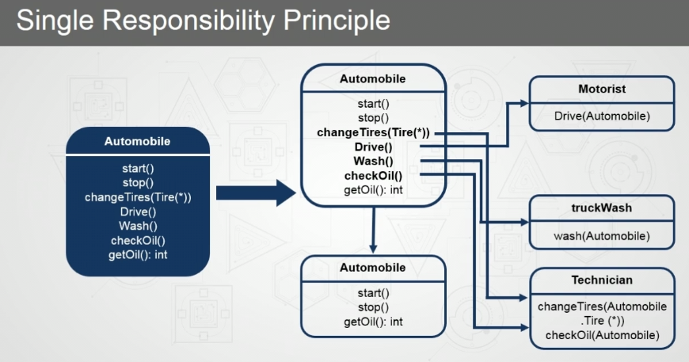
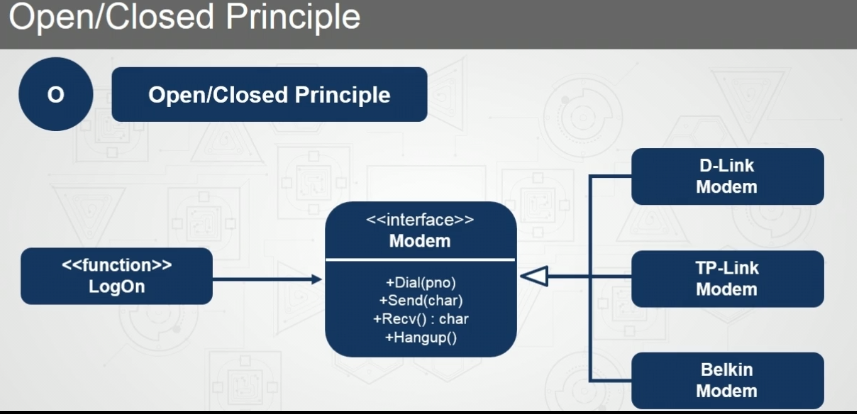
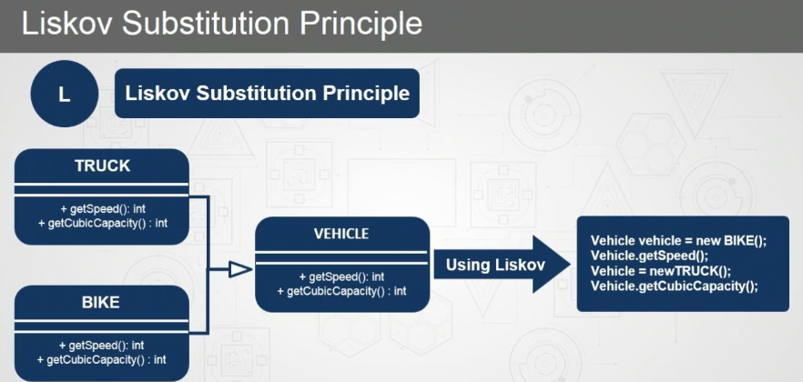
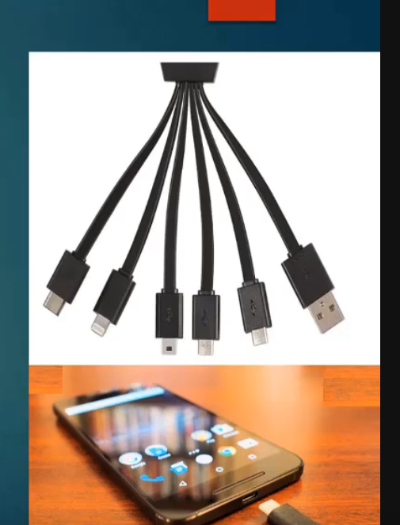

# SOLID PRINCIPLES
- 
- supposed to use these to implement patterns
- prefer composition over inheritance,
	- composition ex- human class is composition of heart class and brain class.
- prefer interface approach as that helps you handle the dynamic business logic.

# Single responsibility
- 
- here automobile class has multiple responsibilities like washing itself changing tires.
- when in reality its responsibilities should only be start, stop and getOil others can be grouped into different modules
# Open/ Close PRINCIPLES
- 
- here interface modem is open for all to extend but closed to modify.
	- so adding a new modem becomes easy,as it just has to implement the interface.

# Liskov substition principle
- 
- using the vehicle super class I can make the same variable hold bike object and truck object.
- useful for saving space ig?? not sure.

# Interface segregation principle
- you should not force any functions onto implementatoin.
	- 
	- here it doesnt make sense to give the user all different ports when in reality they just need one.
	- the designer forced this onto the user which is bad.

	

