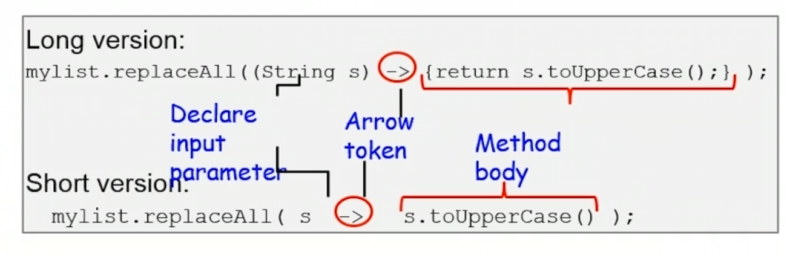
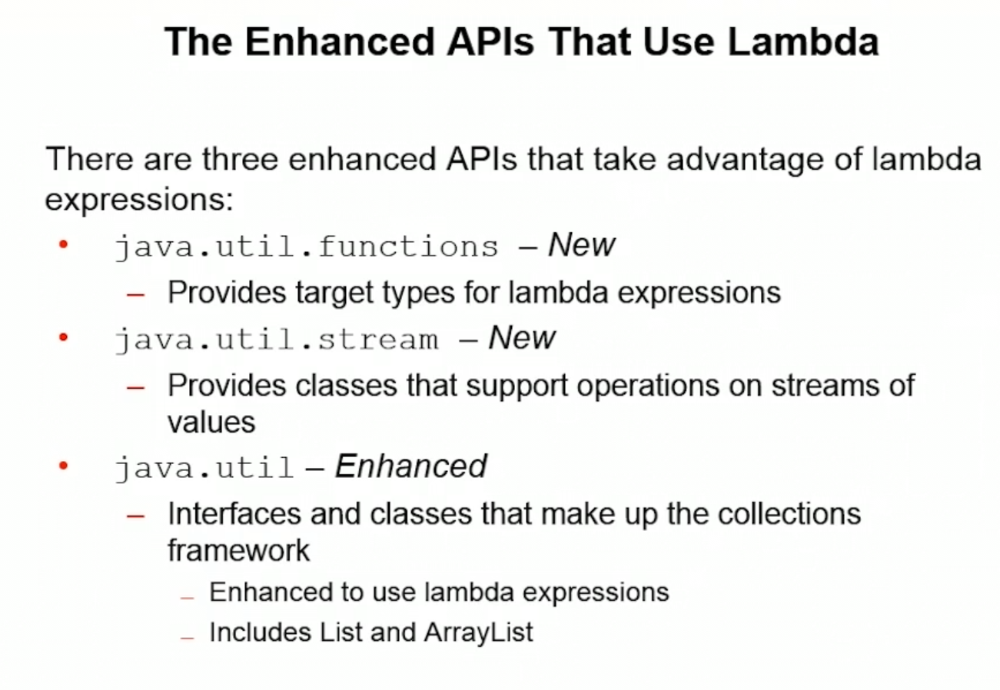
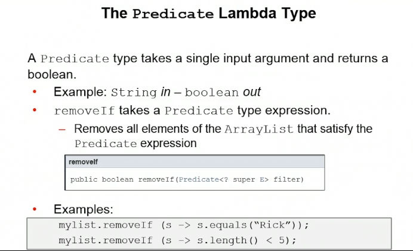

# lambda expressions
- basically a short hand way to write a function
- 
- three apis  use  lamda expressions
	- 
- lambda type specifies the type of lamda you will provide
- unaryOperator means it will accept a single input and return a single value.
- 