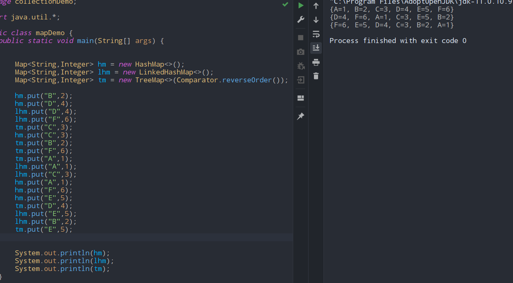

# Map
- # IF KEY EXISTS IT IS UPDATED.
- ## HashMap implementation		
	- #### not thread safe
	- #### fast
	- #### allows one null value
	- #### does not guarantee order
- ## HashTable implementation
	- ####  thread safe
	- #### slow
	- #### No null values
- ## LinkedHashMap impmentation
	- #### does  guarantee order
	- #### same stuff
- ## treeMap impmentation
	- #### does  guarantee order
	- #### also its gonna be sorted
	- #### can be overloaded with comparator
	```java
	Map<String,Integer> hm = new HashMap<>();
	//default size at 16,fill ratio at 0.75
	hm.put("one",1);
	hm.put("two",2);
	hm.put("three",3);
	hm.put("four",4);
	System.out.println(hm.containsKey(1));//false
	System.out.println(hm.containsValue(1));//true
	System.out.println(hm.get("one"));
	hm.remove("one");
	hm.getOrDefault("zero",0);
	for(Set<Integer> e:hm.keySet() )
		System.out.println(hm.get(e));
	for(Map<String,Integer> e : hm.entrySet())
		System.out.println(e.getKey()+e.getValue());
	
	Map<String,Integer> map = hm.entrySet();
	HashMap<String,Integer> hm2 = new HashMap<>();
	hm2.putAll(map);
	```


