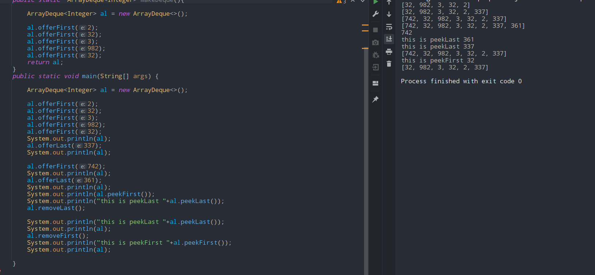

# Queue
- ## LinkedList implementation
	- ### offer(int e)
		- #### safely adds an element in the queue, and returns `true/false`
		- ### do not use `add()` for adding elements in queue, it can throw *`exception`* if some error
	- ### poll(int e)
		- #### safely removes an element in the queue, and returns `null` if not exists
		- ### do not use `remove()` for removing elements in queue, it can throw *`exception`* if some error
	- ### peek() 
		- #### returns ther head of the queue
		- ### do not use `element()` for seing elements in queue, it can throw *`exception`* if some error
- ## PriorityQueue implementation
	- ### for maxHeap
		```java 
		Queue pq = new PriorityQueue(Comparator.reverseOrder()); 
	```
- ## ArrayDeque implementation
	- ### offerFirst(),pollFirst(),peekFirst()
		- #### they do stuff on the first side
	- ### offerLast(),pollLast(),peekLast()
		- #### they do stuff on the last side
		