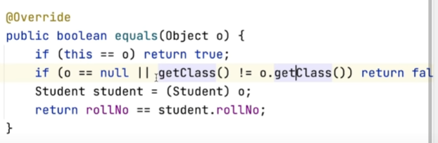
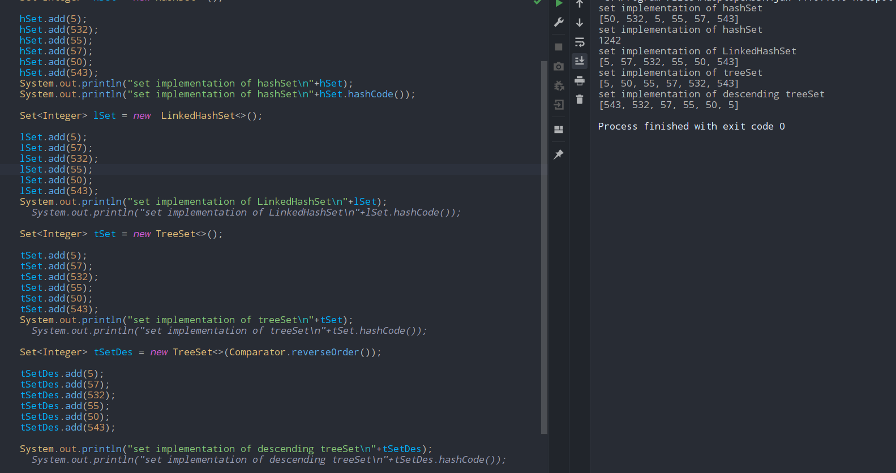

# Set
- ##### no duplicates allowed
- ##### every element is hashed
- ## HashedSet implementaion
	- # $O(1)$
	- ##### everything is optimised
	- ##### order is not defined
	- ## add(),contains(),remove(),isEmpty(),clear()

	- # you need to provide equals() method if you want to compare custom classes
	- ## hashCode(), returns the sum of the hashedSet
	- 
	- ### here the student class is compared based on the roll no.

- ## LinkedHashedSet implementaion
	- #### brings the property of linked list
	- #### order is maintained
	- ## add(),contains(),remove(),isEmpty(),clear()
- ## TreeSet implementaion
	- #### $O(logn)$
	- #### brings the property of BST
	- #### order is maintained and is  sorted
	- ## add(),contains(),remove(),isEmpty(),clear()
	```java 
	Set tSetDesc = new treeSet(Comparator.reverseOrder()); 
	```
	- ### this creates a descending order bst.


