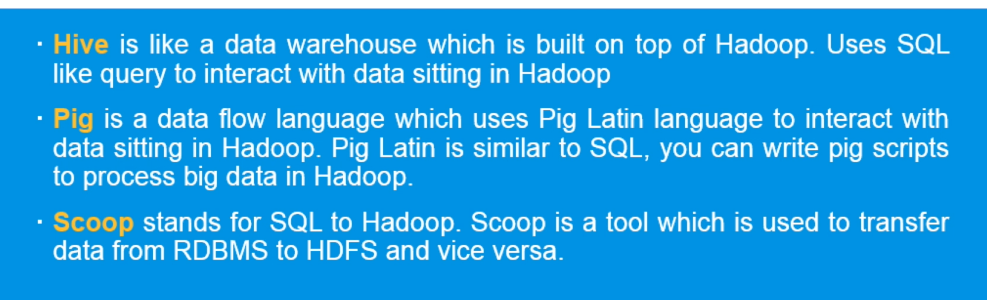
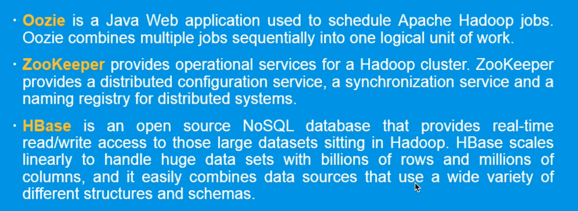
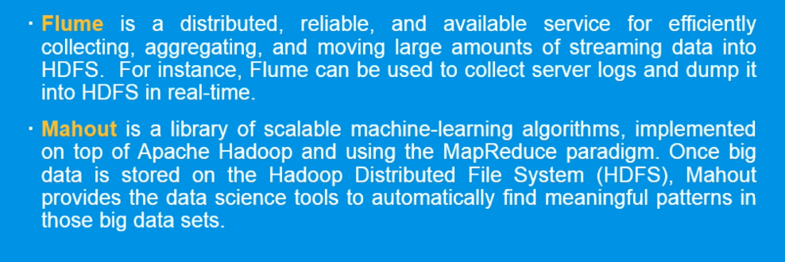
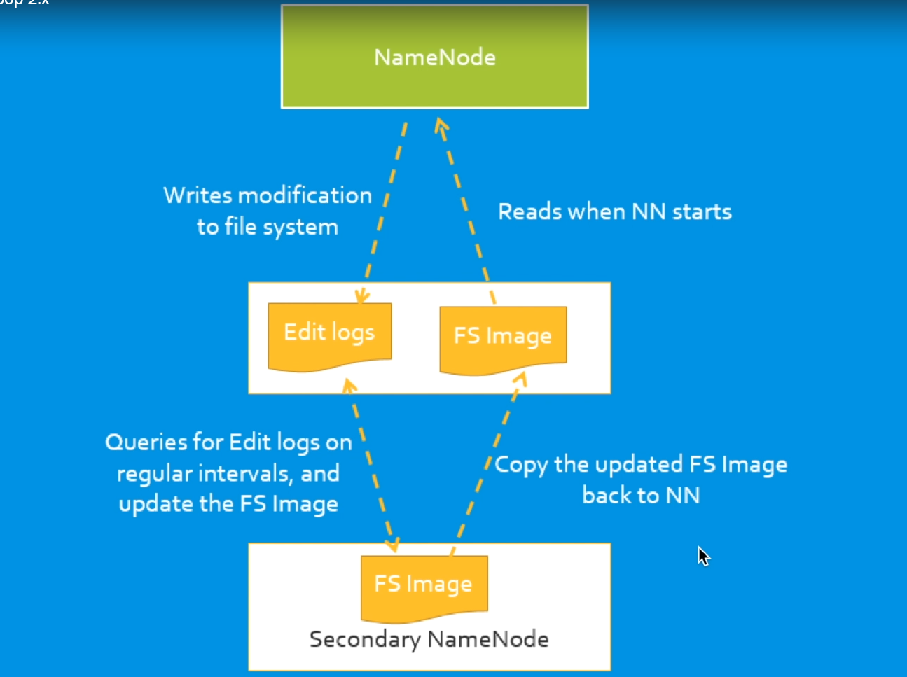
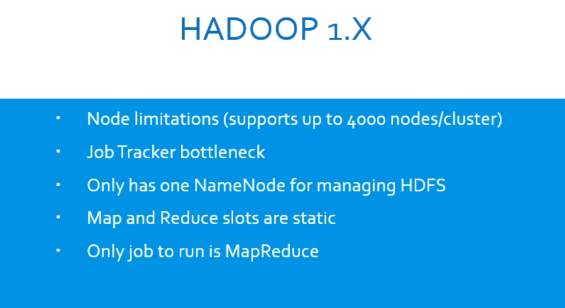
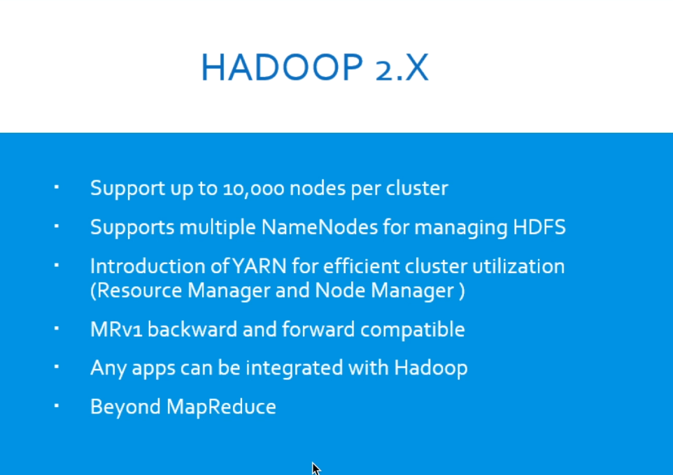
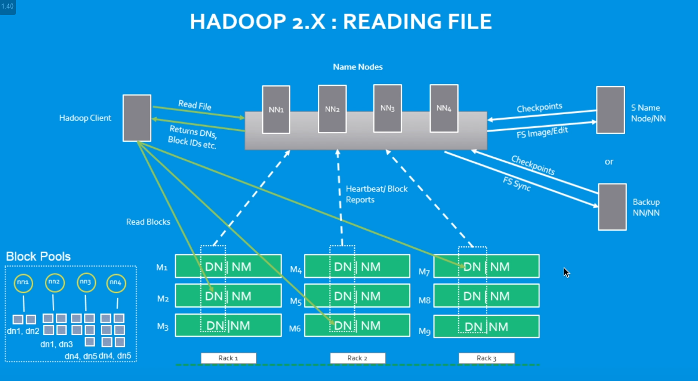
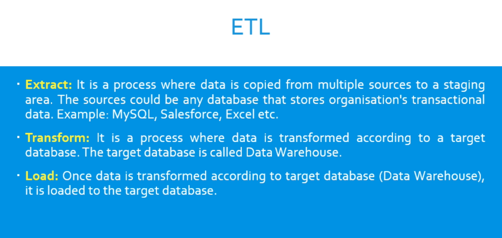

# Hadoop 
- its mainly about hdfs and map reduce on a very high level
- it has many more compoenents that each meet certain businees needs.
- 
- 
- 
# Hadoop v1
- 
- describes the job that is supposed to complete
- name node bassically has meta data and is master of datanode 
- hdfs has 64mb as block size
- for high availaibility hadoop has replication
## suffers from  single point of failure 
-     
	
	- FS is file system in the cluster which is the meta data we was talking about.
	- lotta problems
- 
# hadoop V2
- 
- 

	- key advantages are the high availaibility of the name node.

# ETL
- 
- ## THE HARD PART IS THAT IT IS NOT FLEXIBLE FOR NEW BUSINESS needs
- SO WE CAN OFFLOAD THE TRANSFORMING PART TO LATER WHENCE THE DATA
 IS TRANSFFERED IN RAW FORMAT TO THE DATABASE AND HENCE 
- # ELT  WAS BORN.

