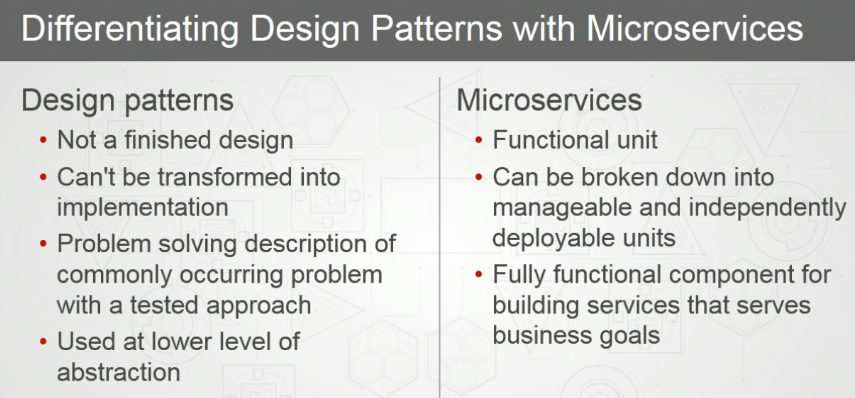
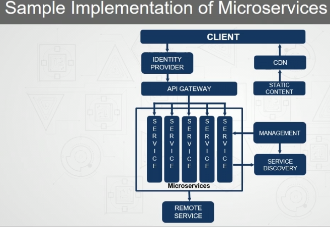
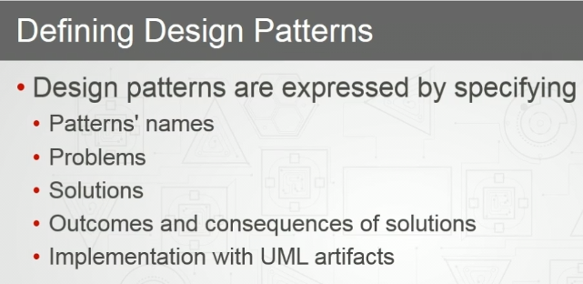

# Design Patterns
- used at a lower level of abstraction.
- 
- ### dp heavily relies on oop concepts
- 
	- microservices containers help you add or remove the service that you want to provide.
	- API gateway help you make these servics discoverable.
- ### christopher Alexander proposed the idea,then beck and cunnigham.
- ### but never took off due to monolithic nature.
- ### gof helped raise the trend.

## high cohesion and low coupling is good
- high cohesion means that the code is highly inependent
- opposite of the heading above makes code brittle.
# defining dp
- 

