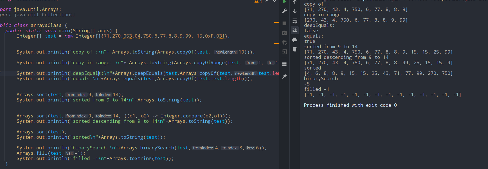

# arrays
- #### binary search
	- same as in collection
- #### copyOf(inp,len)
	- #### returns a shallow copy with new length , truncates or paddes as needed
- #### copyOfRange(inp,begin,end)
	- #### returns a shallow copy with new length , truncates or paddes as needed
- #### equals and deepEquals
	- #### both need 2 arrays
	- #### deepEquals checks refs too
- ### sort(arr,begin,end), sort(arr,begin,end), sort(arr,comparator)
	- #### guess kar
