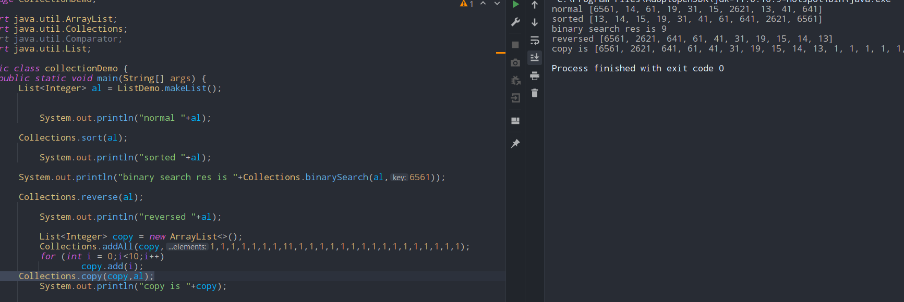

# collection class
- ### throws NullPointerException if object passed to methds is `NULL`

- ##### Collection.addAll(collectionChild,i0,i1,i2,i3)
	- ##### adds the elements to the collectionChild
- ##### Collection.sort(collectionChild,comparator)
	- ##### sorts according to the optional comparator
- ##### Collection.reverse(collectionChild)
	- ##### reverses the child, inplace
- ##### Collection.binarySearch(collectionChild,key)
	- ##### finds the key, if not exists then it returns the possible `place it could have been`
- ##### Collection.copy(collectionChildDest,collectionChildSrc)
	- ##### copies the contents of src to dest `only if dest size is greater or same`.

