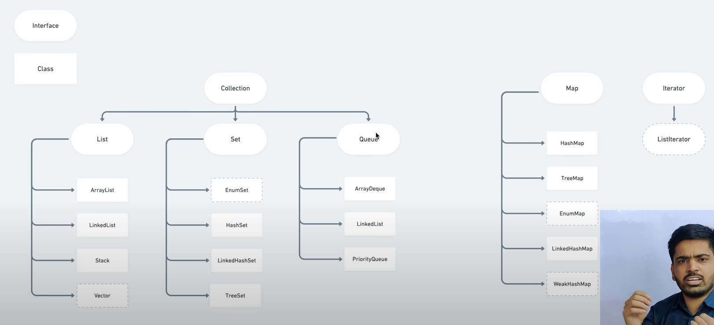

# imp collection stuff
- ### Basically collection is divided into 3 
- ### children interface namely
	- #### List
	- #### Set
	- #### Queue
- ### Map interface , Iterator is  kept separate.
- ### LinkedList does both Queue and List implementation.
- ### ArrayDeque can be used for sliding window questions

- ### important methods you didnt know about
- ### here im making everything int

