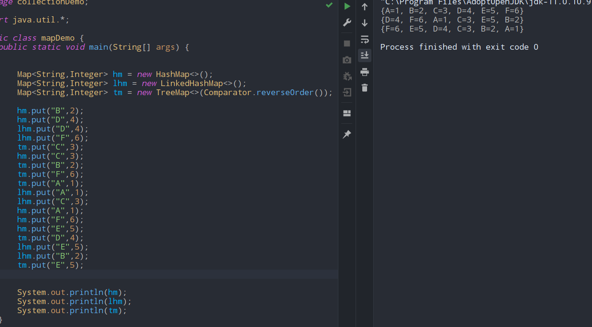

# Map
- ### IF KEY EXISTS IT IS UPDATED.
- ## HashMap impmentation
	- #### does not guarantee order
	- #### default size at 16,fill ratio at 0.75
		- ### containsKey()	//key
		- ### containsValue()		//value
		- ### keySet()
		- ### valueSet()
		- ### put()	//k,v pair
		- ### get()	//key
		- ### remove()	//key
		- ### putAll()	//a map obj
- ## LinkedHashMap impmentation
	- #### does  guarantee order
	- #### same stuff
- ## treeMap impmentation
	- #### does  guarantee order
	- #### also its gonna be sorted
	- #### can be overloaded with comparator

