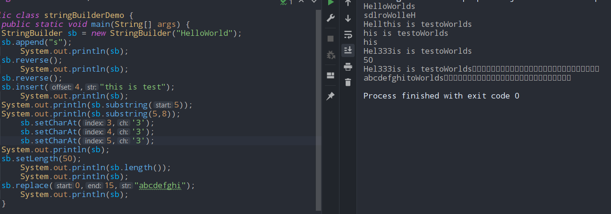

# StringBuilder
- #### not thread safe, but fast.
```java 
StringBuilder sb = new StringBuilder("HelloWorld");
```
- #### .append(s)
	- #### adds "s" to sb
- #### .reverse()
	- #### reverses the sb content
- #### .replace(start,end,string)
	- #### replaces the content from start to end in from the  string in the sb obj.
- #### .substring(begin)
	- #### substring till end of string
- #### .substring(begin,end)
	- #### substring till end index
- #### .insert(offset,s)
	- #### another string s is added at offset 
- #### .setCharAt(index,char)
	- #### char at that index is changed to char you supplied.
- #### .setLength(newLength)
	- #### padds extra null character '\0'  in the sb if newLength is greater than cuurrent size.
