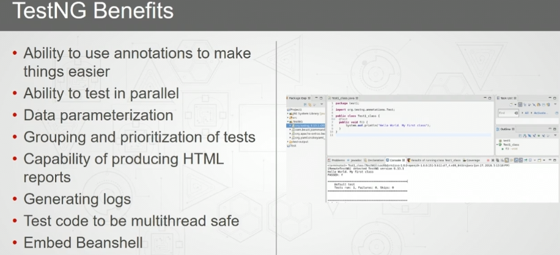

# JUNIT

- [difference between junit 4 and junit 5](https://www.youtube.com/watch?v=hqbSjkQxGwU)
- junit can run two classes parallely.
-  `@beforeClass` and `@afterclass` occur before and after all the testing is over.
# testNG
- 
- 
- 
