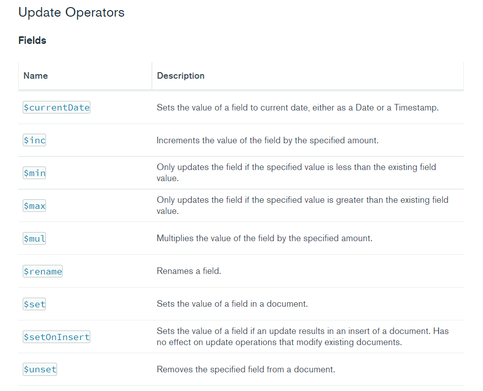

# inserting
- `db.collectionName.insert(jsonObjectHere)` is used to insert one.
- for Many you do this.
 	```c++
	db.collectionName.insertMany(  
		[jsonObjectHere,  
		jsonObjectHere,  
		jsonObjectHere,  
		jsonObjectHere])  
	```
#showing rows
- to get all the rows of the db you do
	```c++
		db.collectionName.find()
	```
- for prettier version
	```c++
		db.collectionName.find().pretty()
	```
- to get all the rows of the db of specific param
	```c++
		db.collectionName.find({number:456}
	```
# sorting
- you mention the param by which you want them sorted
- ```db.collectionName.find().sort({ title: 1 }).pretty()```
# counting
- for counting stuff conditionally
``` 
db.collectionName.find().count()  

db.collectionName.find({ category: 'news' }).count()  
```  

# forEach
-  
```
db.collectionName.find().forEach(function(doc) {
  print("Blog Post: " + doc.title)
})
```

# update
- here you have to mention `{upsert:true}` if you wanna add if it doesnt exist.
```
db.collectionName.update({ title: 'Post Two' },
{title: 'Post Two',
  body: 'New body for post 2',
  date: Date()
},
{upsert: true})
```
- if you wanna update then, find that particular enrtry and then update it .
```
db.collectionName.update({ title: 'Post Two' },
{$set: {
    body: 'Body for post 2',
    category: 'Technology'
  }
})
```
- here $set is mongo var.

# increment
- here it increases **by the number** you have provided
```
db.collectionName.update({ title: 'Post Two' },
{$inc: {
    likes: 5
  }
})
```

-   

## Delete Row

```
db.collectionName.remove({ title: 'Post Four' })
```
## Delete manyRows with condition

```
db.collectionName.deleteMany({ title: 'Post Four' })
```
## Sub-Documents

```
db.collectionName.update({ title: 'Post One' },
{
  $set: {
    comments: [
      {
        body: 'Comment One',
        user: 'Mary Williams',
        date: Date()
      },
      {
        body: 'Comment Two',
        user: 'Harry White',
        date: Date()
      }
    ]
  }
})
```

## Find By Element in Array (\$elemMatch)

```
db.collectionName.find({
  comments: {
     $elemMatch: {
       user: 'Mary Williams'
       }
    }
  }
)
```

## Add Index

```
db.collectionName.createIndex({ title: 'text' })
```

## Text Search

```
db.collectionName.find({
  $text: {
    $search: "\"Post O\""
    }
})
```

## Greater & Less Than

```
db.collectionName.find({ views: { $gt: 2 } })
db.collectionName.find({ views: { $gte: 7 } })
db.collectionName.find({ views: { $lt: 7 } })
db.collectionName.find({ views: { $lte: 7 } })
```