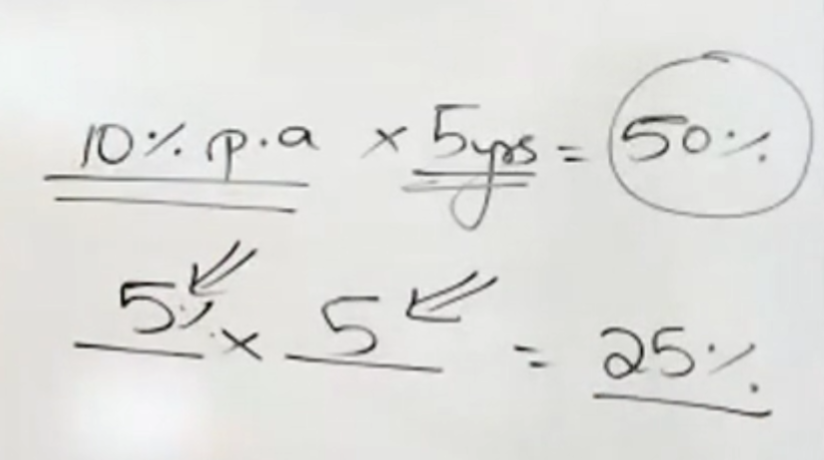
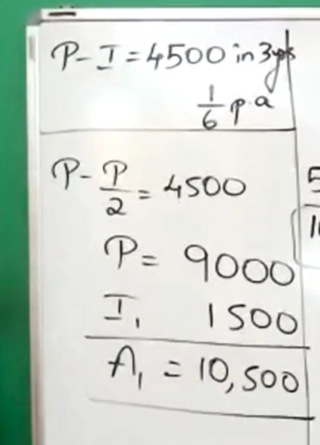
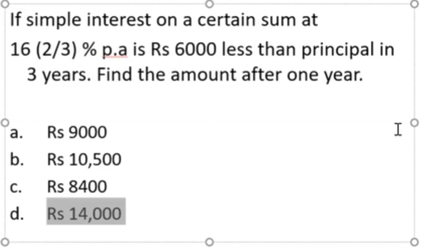
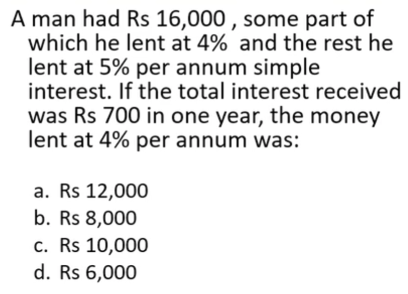
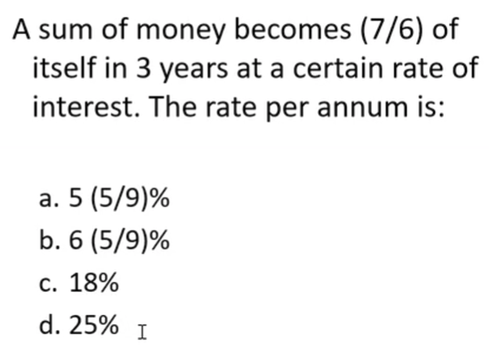
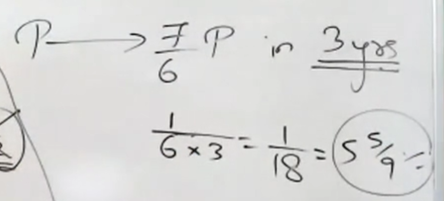

# Simple interest
- 
- #### the question was SI is $\frac{1}{4} th $ of the sum ,if time and interest were numerically equal, what is the SI.
# interest is always on the principle amount
- ### so it'll always increase in contant amount
# ones with given interest rate, period after x years and the amount for that period
- 
- ### here the interest is $16\frac{2}{3}$ which in fraction  is $\frac{1}{6}$
- ### so multiply that witht the period , which is 3 here and thats your `extra amount` from the principle.
- ###  then this $\frac{1}{6}$ can be used to find the amount in x years
- 
- ### here the amount after one year is $\frac{1}{6}$ th $\frac{12000}{6}$ which is 2k.
##trying out options
- 
- ### here  the trick he says is to simulate the options in such a way that it satisfies the conditions
- ### he also goes on to say 4% of 10k is a type of calculation where you will get a 0 in answer's tens place, but wont for other options.
# for times with intrest rate
- 
- ### here the solution is given by taking the extra amount out and by $/$ing  the amount by the period
- 