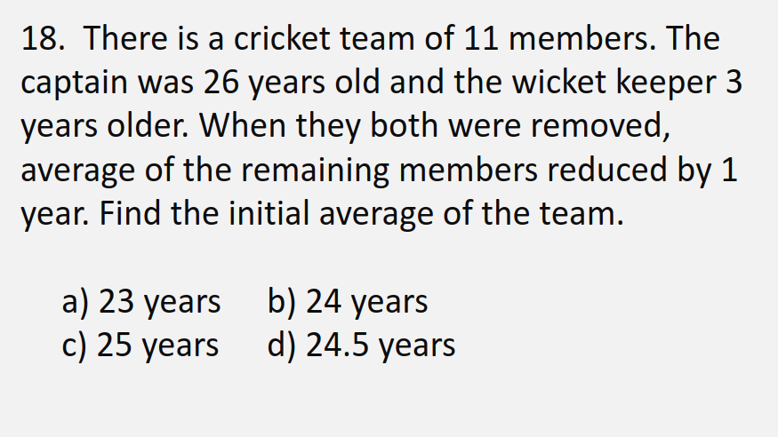

# Averages
`100,200,300,400...900`  

### when difference between the terms is constant `middle term` is the average.  
$$ avg = \frac{first+last}{2} $$      

### when they have given an average and given some numbers and a X

  - #### find how far every number is away from the Averages.    
  
  - #### add it and the x is going to be that many times bigger than average.  
  
### when there is miscalculation  
- #### find how much they are off by and divide by the number they have given then subtract  or add it depending upon if the miscalculation was more or less respesctive.

# when average of age y is given, say x years ago
- ## **their current average is y+x.**

# when they have given the average and someone leaves.
 - `there are 2 possibilities`
    - tthe average either `reduces` or `increases`
      - if it `reduces` then `person who left` had `more than the average`.
      - if average `increases` then `person who left` had `less than the average`
  - their `value`  is going to be
  
  $$value  = rest*amountOfAverageChange $$

# LAST RESORT IS TO CHECK OUT OPTION AND TRY TO SIMLUATE\

- example   

- isme check out option and simulate the things they saying
