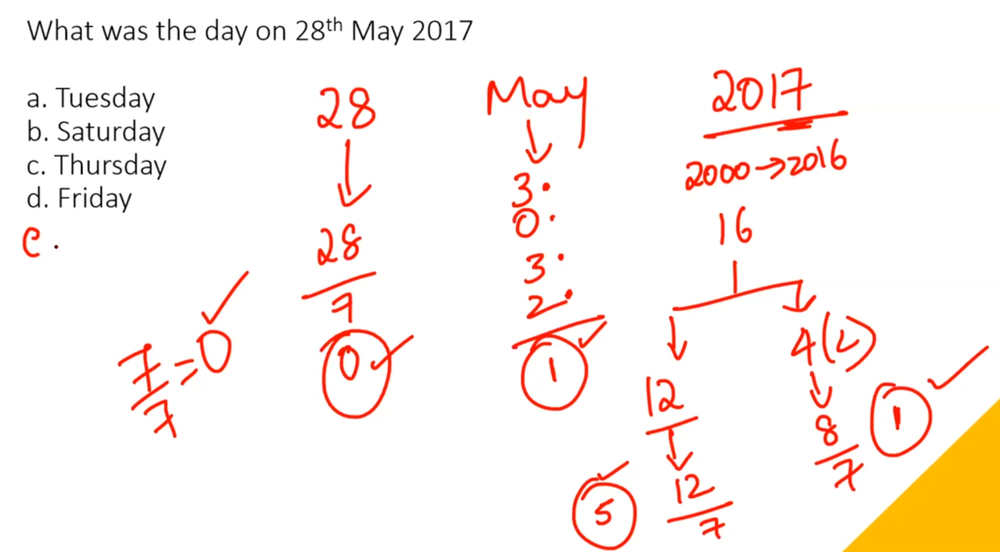
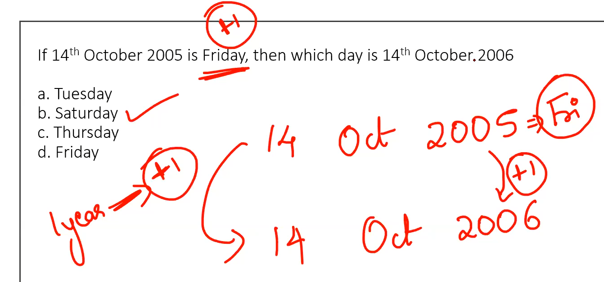
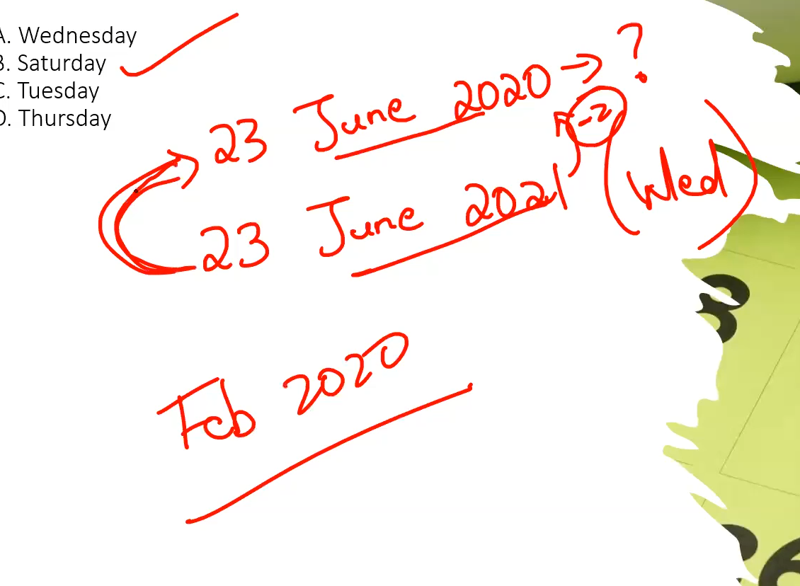
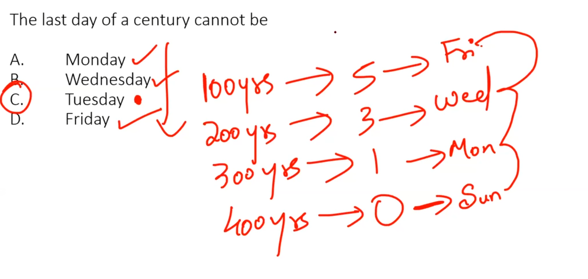

- # you've gotta memorise these numbers.
```python
normalYear =  "1 extra day"
leapYear = "2 extra days"

100 Years = "5 extra days"
200 years = "3 extra days"
300 years = "1 extra days"
400 years = "0 extra days"
```
- ## SINCE 400 YEARS IS 0 DAYS , EVERY LEAP CENTENNIAL IS A REFERENCE
- # also remember these remainders, for repeatation
```python
+1 = "6 years"
+2/+3 = "11 years"
leapYear = "28 years"
```
- these days repeat after these many years.

- # every month has these extra  days
```javascript
jan = 3
normal feb = 0
ly feb = 1
mar = 3
april  = 2
may = 3
june = 2
july = 3
august = 3
sept = 2
oct = 3
nov = 2
dec = 3
```
- # here each day is the number it is associated with
|day|number|
|--|--|
|sun|0|
|mon|1|
|tue|2|
|wed|3|
|thu|4|
|fri|5|
|sat|6|


- # youve gotta work your way till that month and year .

- #### see here the date is basic division, 
- #### month is every month before it
- #### centennial year is the reference year and `not 2016`
	- ## from reference year calculate the number of leap and normal years.
		- ### here 2000 se you have 16  years, 4 ly, rest 12 normal
		- ### now every ly has 2 extra and normal have 1 extra, adding upto 20
		- ### $$20\%7 \quad = \quad  6$$ 
	- ## now the month is every month before may,
		- ### that is $3+0+3+2 = 8$,
		- ### $$8\%7 \quad = \quad  1$$ 
	- ## finally the date is 0
	- ### so your final answer is   
	- ## $$\lparen 6+1 \rparen = 7\\  7\%7 \quad is \quad 0  $$
	- # $$ SUNDAY $$
# reference types

- # when they have given a reference use it to find the nearest  leap year and remember 
	- #	normalYear =  "1 extra day"
	- #	leapYear = "2 extra days"

# tips

- # check the time frame under consideration, `dont rush`
- # one more 


