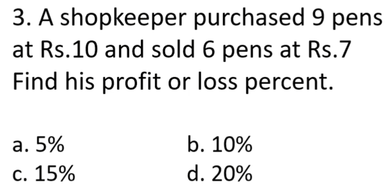
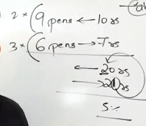
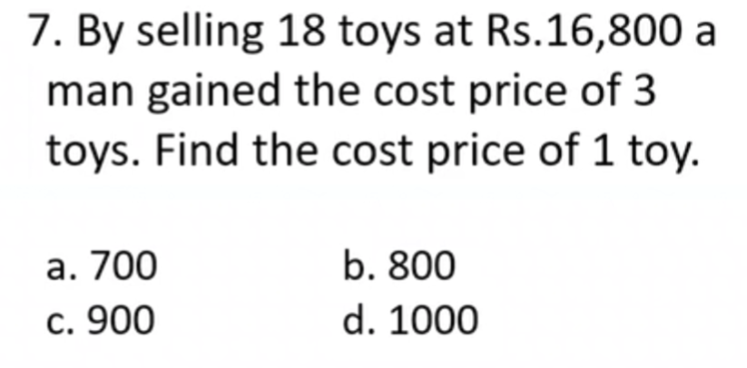
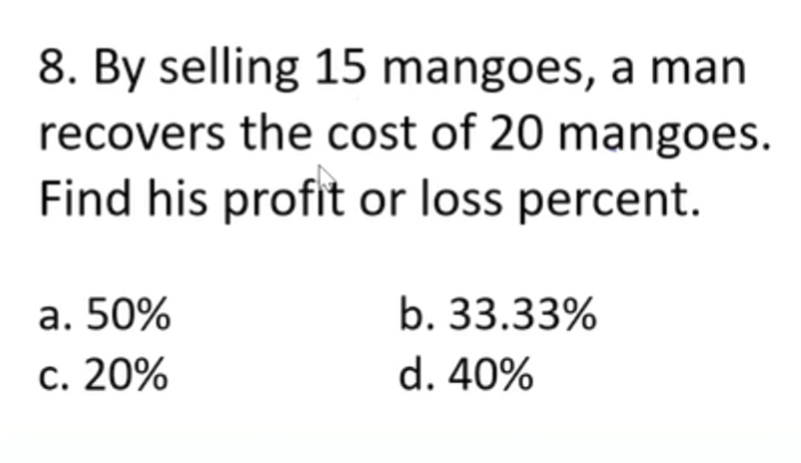
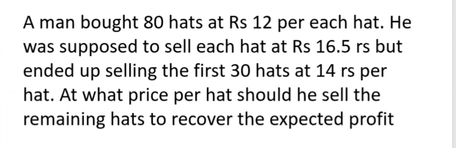
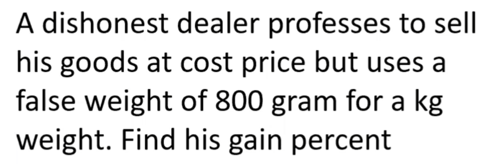
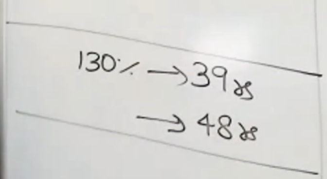

#Basics
- ### if they have given different number of buying items  and diffrent number of selling. you've gotta make them in same number. pretty basic stuff
- 
- #### take lcm of 6 and 9
- 
# if the selling price and cost price is same, then only quantity varies.
- ## the cost of 1 item is 
- $x= sumOfAllItems$
- $$cp/x$$

- here the answer is 16800/(18+3).

- ### here in this case its 5/15.

#diffrent inference

- ### here the selling number of articles is greater than cp of articles, hence they are having loss.
- ### but formula reamains same.
#CAREFUL

- ## in this  one see that on 30 hats he has a loss of 75r from his expected sale of 16.5.
- ## now this 75r loss must be divided equally on the remaining 50 hats to reach his expected sales.
-$$75/50 = 1.5$$
- ## naturally this price must be added to his expected price to get 16.5 avg. hence the cost he must sell at is $16.5+1.5=18$.

# Dishonest cunts
- for these what you gotta do is divide the saved amount by their false unit.

$200/800$ i.e $25$% is ur answer    

#shortcut time

- ## find the bloody 10% first to make life easy.
- ## then calculate 100% and eventutally the % of profit or loss