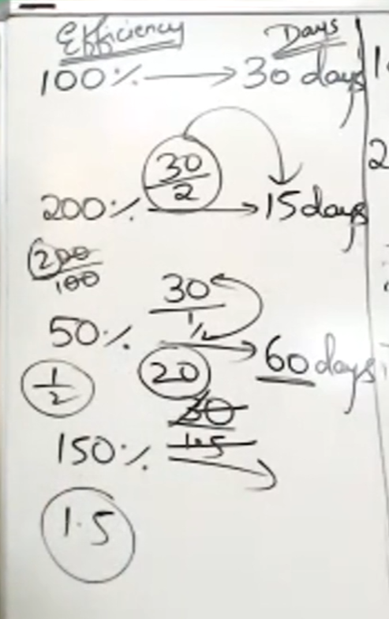
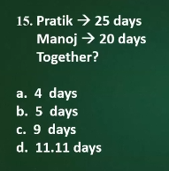
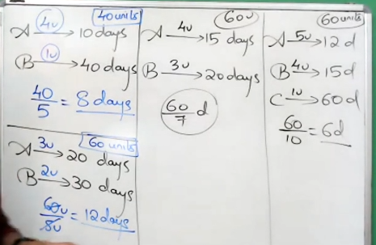
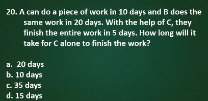
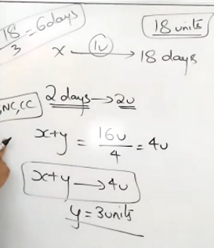
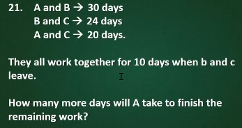

# basic stuff
- ## ye need to know how much work ye doing in 1 day.
	- ##### say you finish working in $23$ days.
		- ##### ye doing $\frac{1}{23}$ work in 1 day.
	- ##### say $23$ men finish the work in $1$ days.
		- ##### each guy  does $\frac{1}{23}$ amount of work.
- ## $$efficiency \propto  \frac{1}{days}$$
- 
# if things are inversly proportional then their products remain same. ex - 
- ##  Man and the days they spend doing are inversely proportional
	- ## $$M_1D_1=M_2D_2$$
- ## work and days are directly propotional
	- ## $$ \frac{W_1}{D_1} = \frac{W_2}{D_2}$$
- # example
- 
- ### here all the things are inversely proportional
	 - #### $18*20*12 = 15*x*9$
	 - #### $x = 32$
- 
	 - #### $\frac{5*6*6}{10} = \frac{12*x*8}{16}$
	 - #### $6*6= 12*x$
	 - #### $x = 3$
# when two or more person involved
- 
- ## their lcm is the units of work ye gotta keep as total work
- ## then find out how much each person does the work in each day and lo ye have answer.
- ## combined effiency is key here

- 
- ## here LCM of $10$ and $20$ is $20$
	- ### A has $2u$  of efficiency ($\frac{20}{10}$)
	- ### B has $1u$ of efficiency ($\frac{20}{20}$)
	- ### A,B,C combined have efficiency of $4u$ ($\frac{20}{5}$)
		- #### therefore C is $1u$ efficient
		- #### C will finish in $20$ days 

- 
- ## lcm of 24 and 32 is 96
	- ### Sharma has $3u$  of efficiency 
	- ### verma has $1u$  of efficiency 
	- ### at the end of 8 days 32 ($4*8$) work is done
	- ### verma is left with 64 units so he'll take 64 days.

- answer is 6 days
- 
-  
- answer is 18 days

- ### $\frac{18}{2}+18 is your asnwer$
- answer is 27