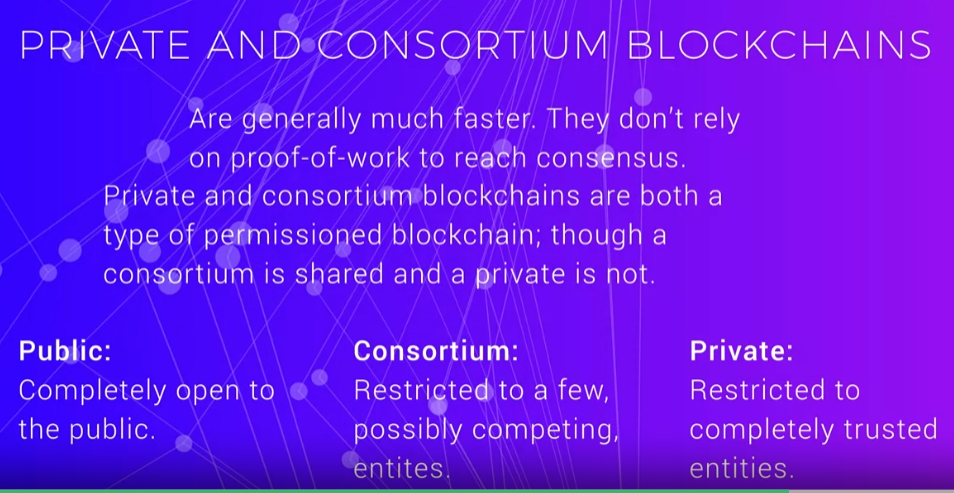
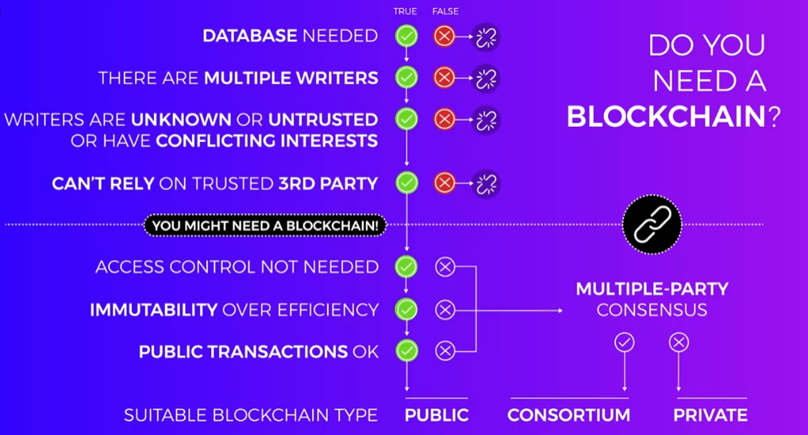

- #### WHO DECIDES TO PUT A BLOCKIN THE BLOCKCHAIN?
- ### thats the consesus algorithms.
	- ####  proof of work
		- ##### here i put my resources to proove im genuine
	- #### proof of stake
		- ##### person with  higher stake money is unlikely to make modifications that devalue their asset.
- ## types of blockchains

- [vitalik buterin's  ](https://blog.ethereum.org/2015/08/07/on-public-and-private-blockchains/)take on types of blockchain.

# when to use blockchain
- 
- some solid  [points](https://www.multichain.com/blog/2015/11/avoiding-pointless-blockchain-project/) to consider.

