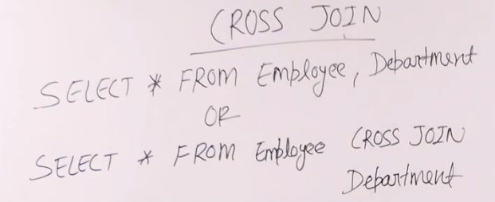
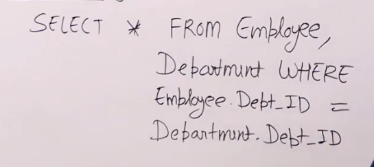
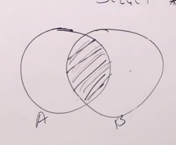

- # `cross` join is exactly what it sounds like, it crosses 2 tables.
	- ##### there's practically no upper limit to number of tables ye can join
	- 
- # `where` clause is basically `inner join`.
	## this is the preffered syntax   
	## over this one  as it is less verbose.
	## the result is the same.
	##  inner represents this in venn diagram
	- ###### basically the common elements from your tables.
	