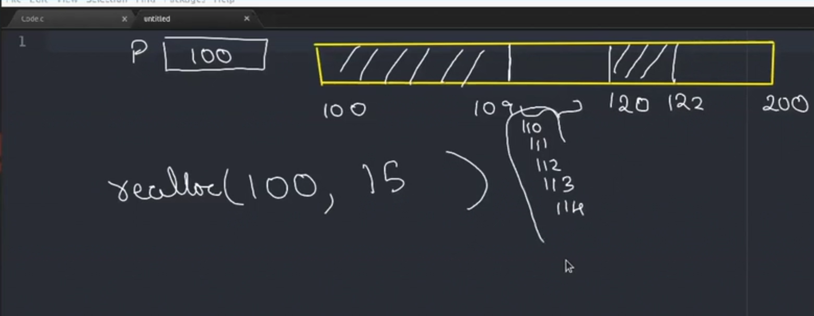

- you can increment a variable only once before you give it a sequence point/checkpoint ,  
( ; this ios what we talking about or , ) in C.
	```c
		int a =10,c;
		c=++a+ ++a;//gives undefined behaviour.
	```

- in `main(int argc,char ** argv )` one param is always the prog name so you'll have always n+1 , where is the no of params you send 

- ## to convert cl args to int, use `atoi` from stdlib
	- always send numeric values here else it returns 0.
	- theres also `atol` and `atof` long and float resp.
```c
	int n = 0;
	scanf("%d",&n);
	int a[n];
```
- this is invalid in c99 compilers. 
# DYNAMIC ALLOCATION
### malloc and calloc declaration. 
- it basically returns a `void pointer` that you must type cast according to ur needs.
```c
#inlcude <stdlib.h>
int *a = (int*)malloc(n*sizeof(int));
int *b = (int*)calloc(n,sizeof(int));
```
- malloc block of memory, calloc is contigous single element with size of the second param
- malloc has garbage mem, calloc initialises to 0.
- if malloc returns 0 , **means no address was allocated**
##realloc
- it reallocates a dynamically allocaterd array.
- it takes 2 params , existing pointer to the dynamically allocated block and newSize , in bytes.
- it returns void pointer too. 
- # if the starting address is less than the orignal size then it returns the same pointer with lower size allocated to it.
- # also if the requested more space in realloc is available in the adjacent place , we'll still get the same address.


# exec of dynamically allocated memory is slower, as allocation takes time during runtime
- ##  reason array is preffered over linked list for binary search is that finding the middle element is slow and inefficient in 	LL.