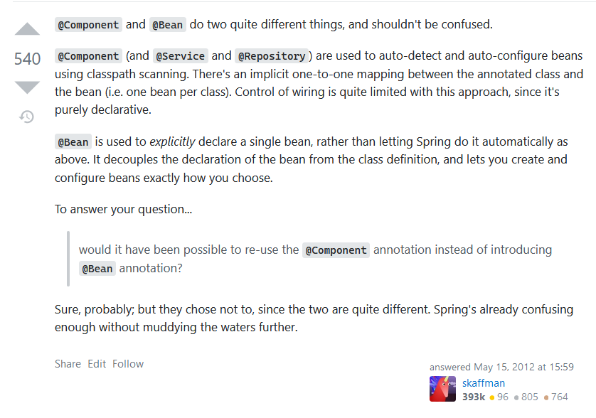
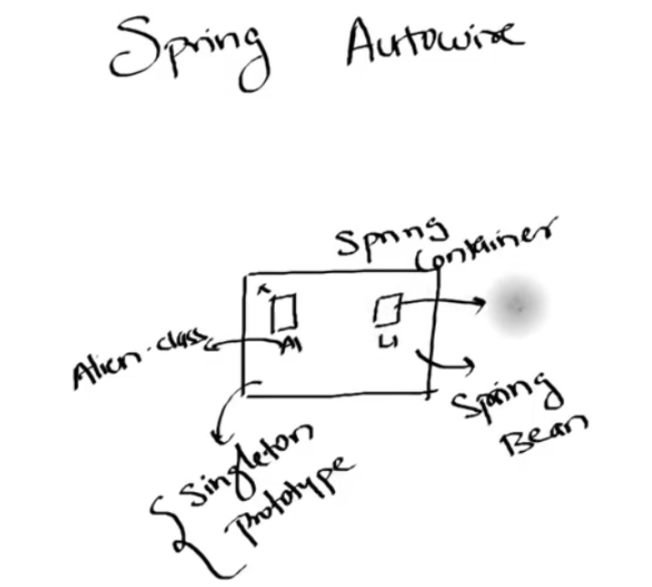

# spring annotations
- [cool link for looking up beans vs component](https://stackoverflow.com/questions/10604298/spring-component-versus-bean)
- `@Component`
	- this automatically finds the class defination, creates the object, assignes it to your object that you have defined..
	- hence excersing depency injection.
	- therby giving you less control
	- 
- `@bean`
# container
- 
- container has all the objects created by spring, that way you dont have to use `new` keyword as that leads to a tighter coupling.
- you can choose to make a class singleton by annotating
- objects inside the container are called spring beans
- you can use `SpringApplication.run(EndPointApplication.class, args).getBean(YourClassName.class)` to get the bean or rather the object created.
## scopes
- it has two scopes, singleton and prototype
#### singleton
- you basically annotate with `@Component`.
- doesnt let you create more than one object.
#### prototype
- you add `@Scope(value="prototype")` under `@Component`.
- lets you create as many objects you want.

# annotations hello world
[baeldung github](https://github.com/eugenp/tutorials/blob/master/core-java-modules/core-java-annotations/src/main/java/com/baeldung/customannotations/ObjectToJsonConverter.java)

