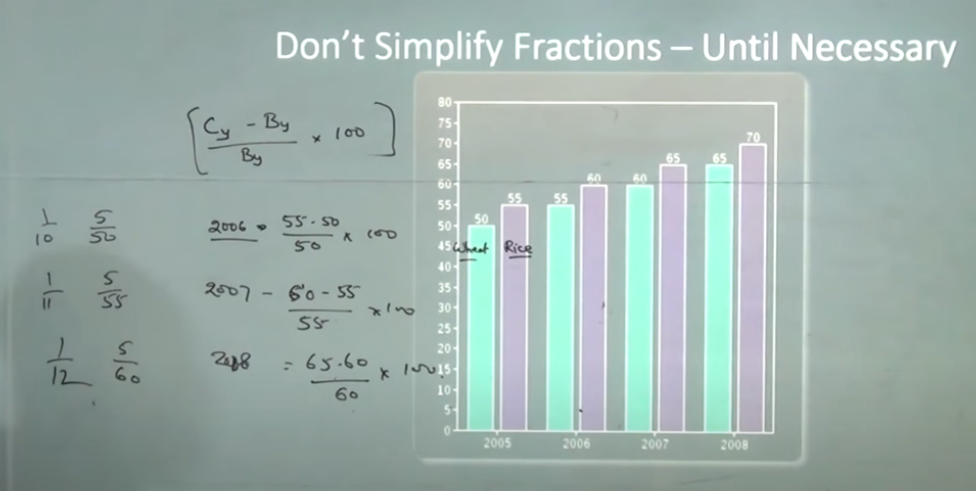
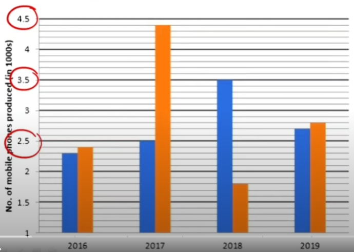
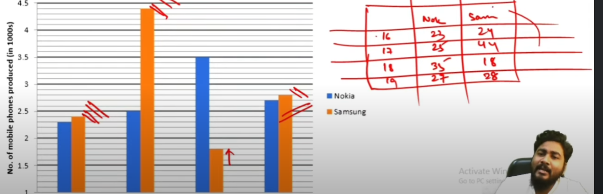
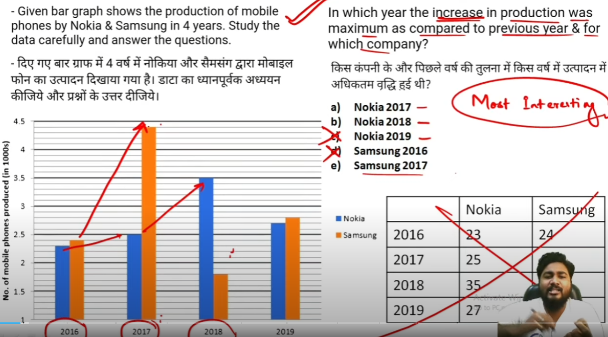

- # types of DI questions
	- ## words as cases
	- ## graphs
	- ## pie charts
	- ## line charts
	- ## tables
- # tricks you need to be good at
	- ## $\%$
	- ## growth rate
	- ## approximation
	- ## unitary method
	- ## cross multiplication 
	- ## pick easy ones

- # approximation
	- ### closer to zero is better
		- #### choose wisely if you reduce the denominator then  answer might be greater than approximation
		
- # growth rate
	- #### $$\frac{Cy -Py}{By} * 100\  is\ growth\ rate$$ 
		- ##### $Cy\ is\ current\ year$ 
		- ##### $Py\ is\ previous\ year$ 
	- #### which year the wheat production highest?
		- 
		- #####  here in 2006 wheat production highest as the growth rate is highest that year

- # what $\%$ of
	- ## questions of these format have this formula
		- ### $x\ is\ what\ \%\ of\ y$ **i.e**    $\frac{x}{y}*100$
		- ### dont simplify fractions till last step
- # what is $\%$ difference of
	- ## questions of these format have this formula
		- ### $x-y$ lol
		- ### stuff will be common here, dont forget  to take common
- # what $\%$ less
	- ## questions of these format have this formula
		- ### $x\ is\ what\ \%\ less\ of\ y$ **i.e**    $\frac{x-y}{y}*100$
- # what $\%$ more
	- ## questions of these format have this formula
		- ### $x\ is\ what\ \%\ more\ of\ y$ **i.e**    $\frac{x+y}{y}*100$
			- #### $y\ is\ greater\ number$

# BAR GRAPHS
-  
- # get rid of the data that are in points and make them integers.
	- ## make use of the scale to up them or down them.
- # make the table for faster lookup
	- ### with the units you set up
	- #### example  
	- #### here units are in `100` and not `1000`

- # sometimes use your approximation skills
- 
- ### see here `increase in production was max` can be observed with the slope 
- ### so naturally you need to see samsung in 2017 as they had steep increase in sale that year