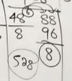

# given two numbers find their hcf and lcm
# type 1
- ##### first find difference
- ##### if difference too big then multiply the smaller number to get till you reach larger number.
- ### **that will be your HCF** 
- ##### just ensure the differnce is smaller than the smaller number.
- ##### check if the difference divides both the numbers
- ##### if it does then divide the smaller number with it and multiply the result with the answer of division 
- ##### multiply that to the bigger number.
- ### **that will be your LCM**

# type 2
- #### here you dont need to do anything the higher number is itself a multiple of the lower.
- #### in this case the lower number is HCF and the higher number is  the LCM
- #### say 25 and 100
- #### here 100 is a multiple of 25, that will be your HCF. 
- #### 100 is the LCM.

# type 3 
- ####  when the 2 numbers dont divide each other 
- #### their difference is the HCF no doubt there.
- #### lcm is found by doubling the larger number till the lower one divides.
- ### example
- #### LCM of 9 and 12
	- ### does $9$ divide $12$?: false
	- ### does $9$ divide $24$?: false
	- ### does $9$ divide $36$?: true
	- ## therefore $36$ is the LCM

# type 4 
- ## when no common factors, just multiply them for LCM, HCF is 1.
#  LCM OF 2 CONSECUTIVE NUMBERS IS THEIR PRODUCT.
# always take lcm of the top 2 numbers and then move to the third.

