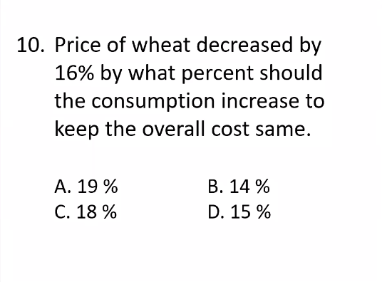

## first trick is to get split the number for percentage

## second trick is to get 1% ,10% and get yo answer.

## third trick is to interchange the number so that you can multiply in a easier way if possible

# percentages on constant increase and decrease
- if they increase and decrease by same amount then the difference in the amount is.  
### $\frac{x^2}{100}\%$ of the initial.  
  ### and is always less

## percentages on different increase and decrease
$$delta = x+y+\frac{x*y}{100} $$
## the signs of x and y depend on increase or decrease

## third way is to multiply such a way that their product is 100, and calculate the %change

# the best way is to assume 100 as the product and apply the changes.
  ## THE ORDER IS IMP.
# where certain thing must remain constant
- put the percentage in fraction and simplyfy it
- decrease the denominator by numerator
- thats ur answer.
## example

$$\frac{16}{100}=>\frac{4}{25}=>\frac{4}{21}$$
## and thats ur answer in decimal

