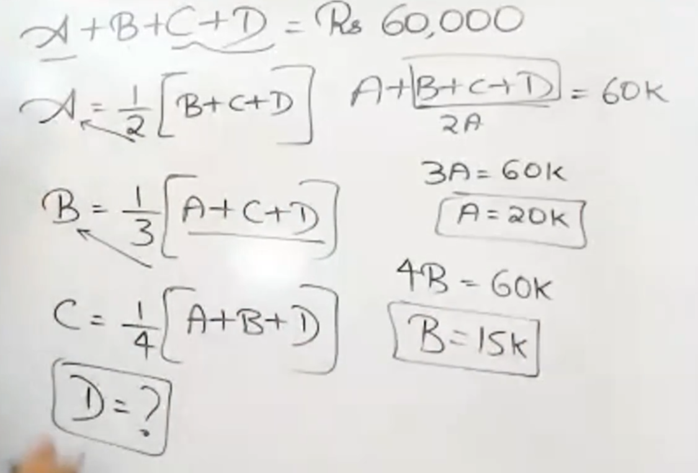
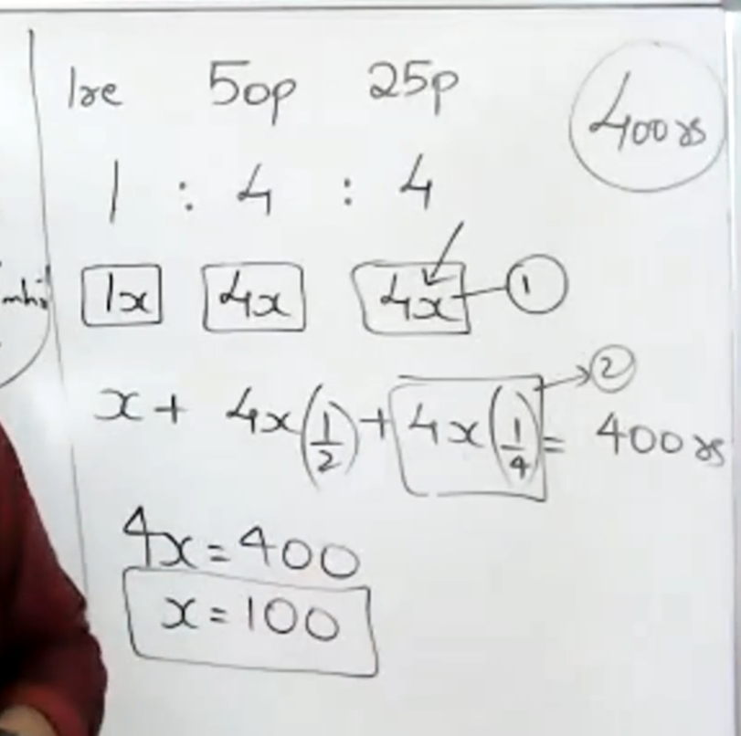
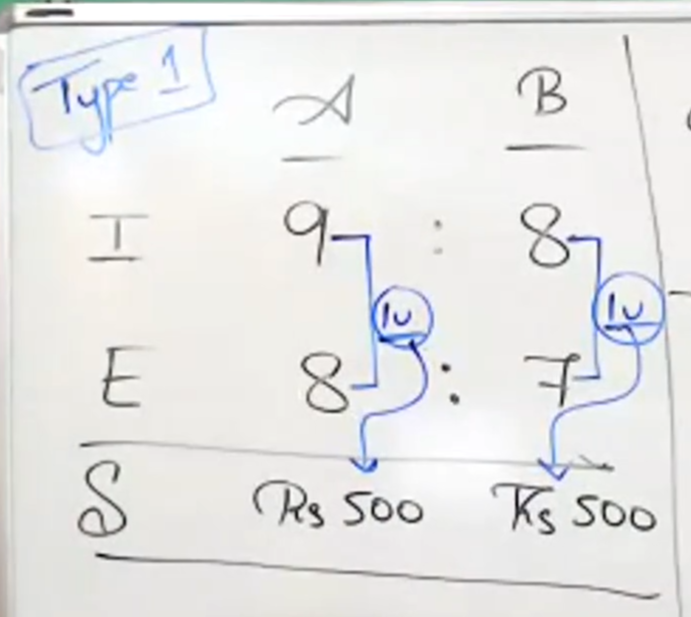
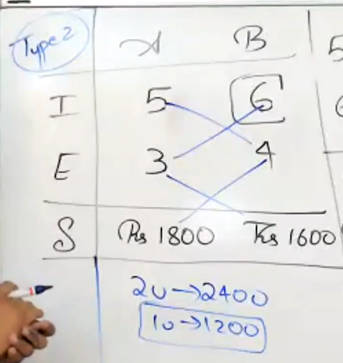
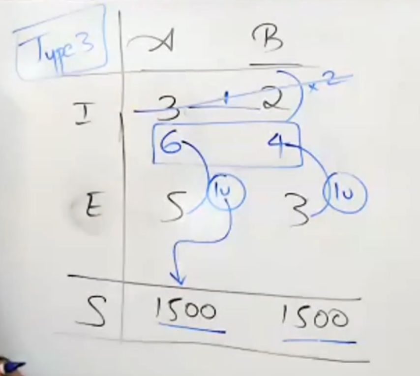
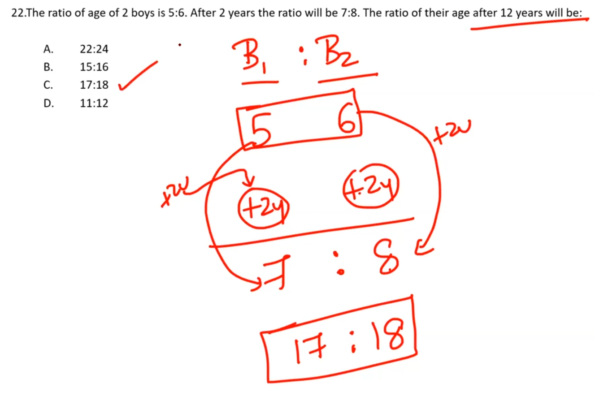
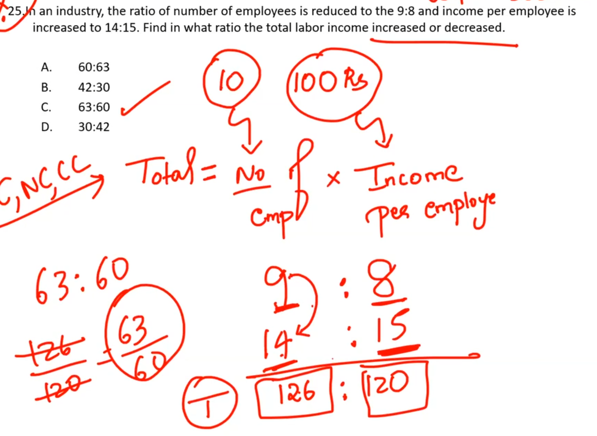

# jargons
- ## compounded = product
- ## sub-duplicate = squareroot
- ## duplicate = squared
- ## triplicate = cube
##simple trick you missed

##you must have a common denotion
- ### here ratio is for the number of coins and not values

#RATIO TRICKS
##type1
- ### things to look for
	- #### difference in the  `income ` and `expense` ratio is same
	- #### their savings must be same as well
- ### only then you can use the trick below
- 
	- ##### here they asking A's salary

- #### here difference is one so 
$$1u = 500$$
- #### using this we can get anything
##type2
- ### things to look for
	- #### difference in the  `income ` and `expense` ratio is same
	- #### their savings aint gonna be same
- 
	- ##### here they asking B's salary

 - ### here we do $5*4-6*3 = 2u$ for lhs
- ### here for we do $4*1800-3*1600$  for rhs
- ### finally you have 
$$2u=2400$$
- ## hence you have `1 unit as 1200`
##type3
- ### things to look for
	- #### difference in the  `income ` and `expense` ration is different
	- #### their savings is same

-   
	- ##### here they asking B's salary
- #### make the difference the ratio's numerator and denominator as same 
- #### here 2 is multiplied for income ratio cuz it is the lcm of $3-2$ and $5-3$m and `TOTALLY` discard the previous ratio
- #### yo answer is $1500*4 = 6000$
# !! attention!!

- see here the difference between new  ratio and the age differnce is same so just add the 12 to initial ratio.

# leaving and joining
- ## try out the options

# tricky

- #### here ratio is for previous and new.
- #### try to go according to the root formula of things.
- ####  like here total labpor income is your formula