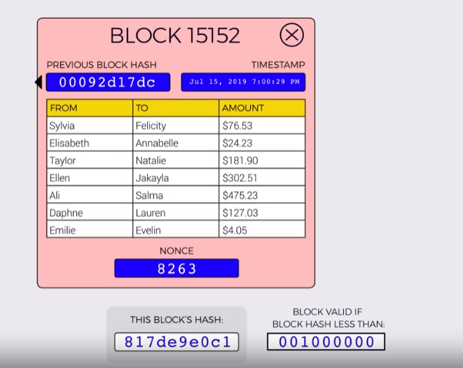

# block structure
- 
- #### Difficulty is what determines the proof of work 
- #### nonce's use is get to altered to get a different hash.
- #### if a hash value is below the blockchain's difficulty value then it is added to the blockchain.
- #### `idea is that lower values are hard to find`.
- #### in bitcoin 19 bits are set to zero.
- ### each block has a size limit, bitcoin is 1mb, eth is 16mb.

