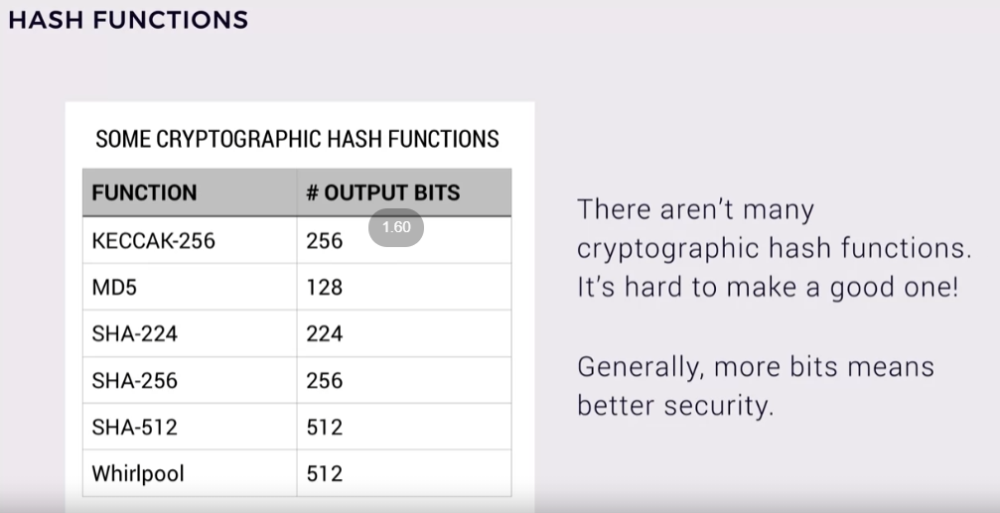
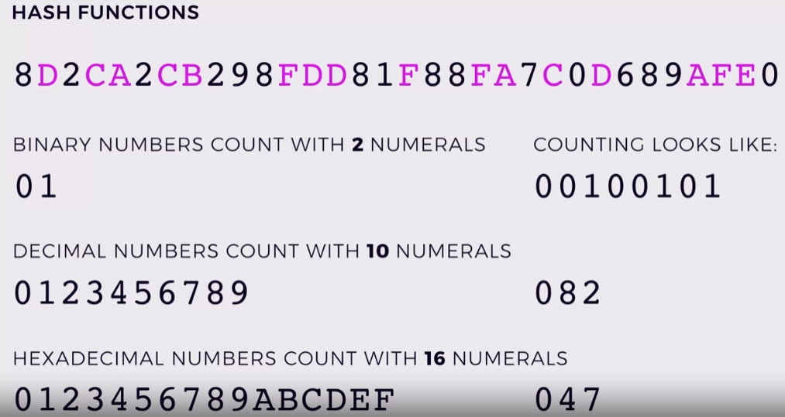

### all the different hash functions
-  
- ## hash is hexadecimal in nature
- 
# DIGITAL SIGNING
- ## encrypt with private, decrypt with public.
- ### here  we need to verify the source.

- #### say i want to send a file to nidhi akka.
- #### i will generate the hash of the file, encrypt it using my private key and send the encrypted hash along with the file.
- ####  once akka gets the file, she can verify if the hash she got along with the file matches the hash she generated on her side.
	- #### 2 things can happen hash can either  match else it wont.
	- #### for failing of hash there are again two possibilities
		- ##### either someone tampered with the hash or they changed the entire file and sent the changed file's hash as it cant be decrypted with my public key.

