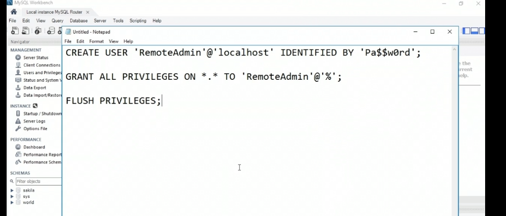
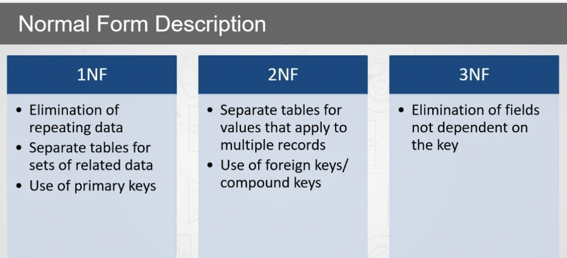

# connections
- 

	- % here means a remote connection.
	- You can restrcit it to a specific IP address
	- Flush privilages basically resets the privs.

- status is the state of each variable, system variable are the ones that you configured with.
- persist means they'd exist even after the reboot cycle.

# NF's
- 

# DDL
- create, update, alter

- schema is basically db without any data, db is schema with data.

- altering the db lets you change the charset only
- altering the table lets yo uchange name, structure 

# group by 
- basically useful in a one to many relationship
- MUST be paired with aggregate function
- the grouped table col is also selected usually.

# count
- count(*) means even null values are included

# string functions
- `Concat(**args)`, means it will concatenate any number of strings you supply
- `Left(string,num)`,`Right(string,num)`, used to trim num chars from left or right
- `Strcmp(s1,s2)`, 0 if same, -1 if left is large, 1 if right is large
- `s1 like s2` clause to check if s1==s2.

# datetime
- `curdate()`
- `date_add(d1,int)` here d1 is a datetime col, int is the interval you want to add.
- `datediff(d1,d2)` gives the difference between the dates, ensure  d1>d2

# temporay table
- lost after session is closed.
- `CREATE TEMPORARY TABLE ....`, same as normal after wards.
