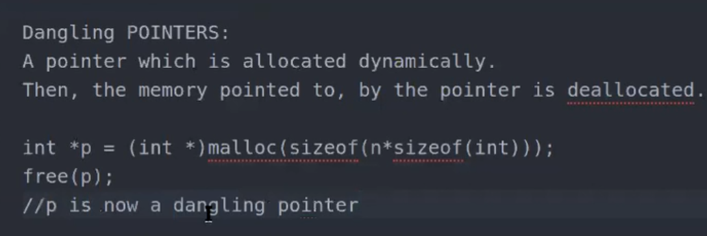

# dereferenceing operator
- works from  <h1 style="{display:inline-block}"> right to left </h1> 

# types of pointer
## wild pointer
## NULL pointer
## void pointer
## Dangling pointer
.

- const variables can be modified with pointers that are not const
