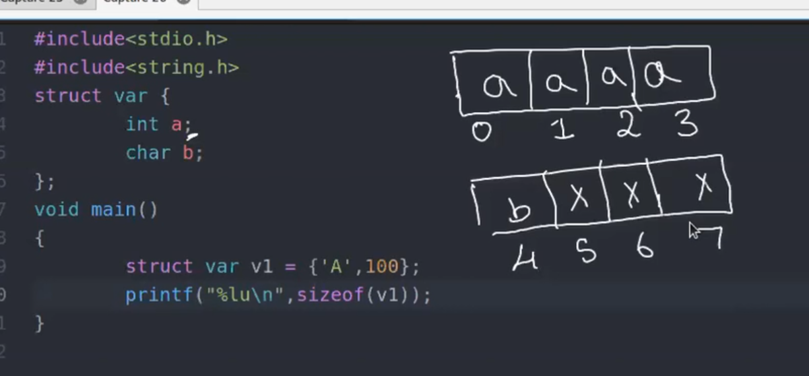
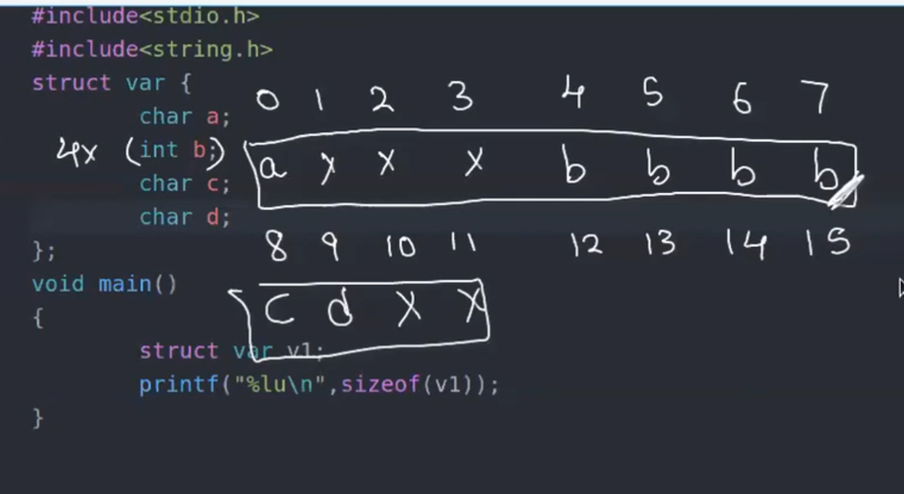
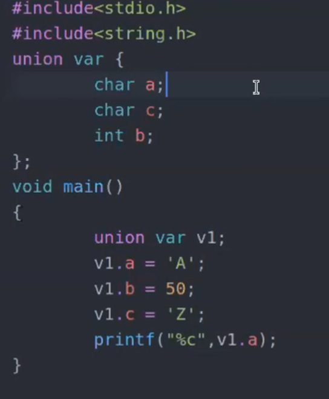

#structs
- you cant *assign* once the struct is *declared.*
- they can only be given value only on initialisation. 
- only problem with strings 

# struct padding

- here the lower sized data type is padded to meet the higher sized data type called as struct padding. 
 

- yahan pe if int was placed last the size would have been 8.

- its addvisable to write the size in ascending  order. 

# UNIONS
- in unions all the  variables use same space given to them, i.e the largest data type available to them .

- so this guy gives you `Z ` as output and **not** `A`

